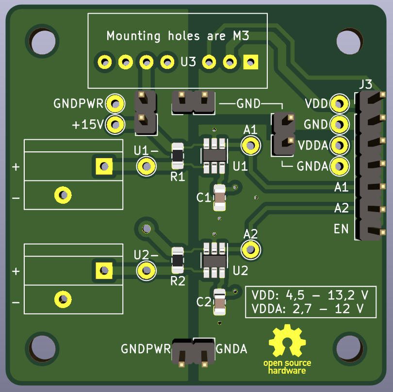

# 2ch-4-20mA-converter

 

This board converts two *4 - 20 mA* signals to a voltage using a `LMP8640` *Current Shunt Monitor* from *Texas Instruments*. To provide power to the *4 - 20 mA* sensors a `TEC2-0913` 2W 15V Isolated DC-DC converter is used from *Traco Power*. Quick-connect terminals from *Phoenix Contact* are also used.

To allow for extensive testing three separate GND nets/planes and a lot of test points are used. They can be connected together using jumpers if necessary. The power supply can also be disabled and fully disconnected from the sensors using a jumper as well (wich can also be used to measure the in-line current given to the whole sensor circuit).

- Click [here](hardware/2ch-4-20mA/2ch-4-20mA.pdf) to go to the **schematic**.

 

 &nbsp; &nbsp; &nbsp; &nbsp; &nbsp; 

 

## LMP8640 vs INA196

A lot of designs still use the `INA196` *Current Shunt Monitor* from *Texas Instruments*. In the picture below is a comparison between the `LMP8640` and the `INA196`. No real disadvantage was found to not use the `LMP8640`.

 

 

## BOM

| Component    | Value                | Footprint     | Other                                       | Ordering                                                                                                                                    |
| ------------ | -------------------- | ------------- | ------------------------------------------- | ------------------------------------------------------------------------------------------------------------------------------------------- |
| U1, U2       | LMP8640              | SOT-23-Thin-6 | Texas Instruments Current Shunt Monitor     | [Mouser.be](https://www.mouser.be/ProductDetail/Texas-Instruments/LMP8640MK-H-NOPB?qs=sGAEpiMZZMvu8NZDyZ4K0R0dndN8GI7a)                     |
| U3           | TEC2-0913            | SIP-8         | Traco Power 2W 15V Isolated DC-DC converter | [Mouser.be](https://www.mouser.be/ProductDetail/TRACO-Power/TEC-2-0913?qs=sGAEpiMZZMvGsmoEFRKS8Koqt8Pjkl39l4aaKfuLyMgVYp%252Bicpvd3A%3D%3D) |
| C1, C2       | 100 nF = 0,1 µF      | 0805          | X7R, 16V, 10%                               | [Mouser.be](https://www.mouser.be/ProductDetail/Yageo/CC0805KRX7R7BB104?qs=sGAEpiMZZMs0AnBnWHyRQMMzfhmH8IQX2eB5GrOHrwc%3D)                  |
| R1, R2       | 6,2 Ω                | 0805          | 0,1%                                        | [Mouser.be](https://www.mouser.be/ProductDetail/TE-Connectivity-Neohm/CPF0805B6R2E1?qs=sGAEpiMZZMu61qfTUdNhGxAfPTOoMd3Mys3VDWDGxkc%3D)      |
| R1, R2 (alt) | 4,99 Ω               | 0805          | 0,1%                                        | [Mouser.be](https://www.mouser.be/ProductDetail/TE-Connectivity-Neohm/CPF0805B4R99E1?qs=sGAEpiMZZMu61qfTUdNhGxAfPTOoMd3MWO8ubRKmtsI%3D)     |
| J1, J2       | PTSA_1,5/_2-3,5-Z_BK | Pitch: 3,5 mm | 2 contacts @ 45° (20-16 AWG), 250V 2A       | [Mouser.be](https://www.mouser.be/ProductDetail/Phoenix-Contact/1751765?qs=sGAEpiMZZMvZTcaMAxB2AOnzhHajZlLEGRULH%2FxUGnk%3D)                |
